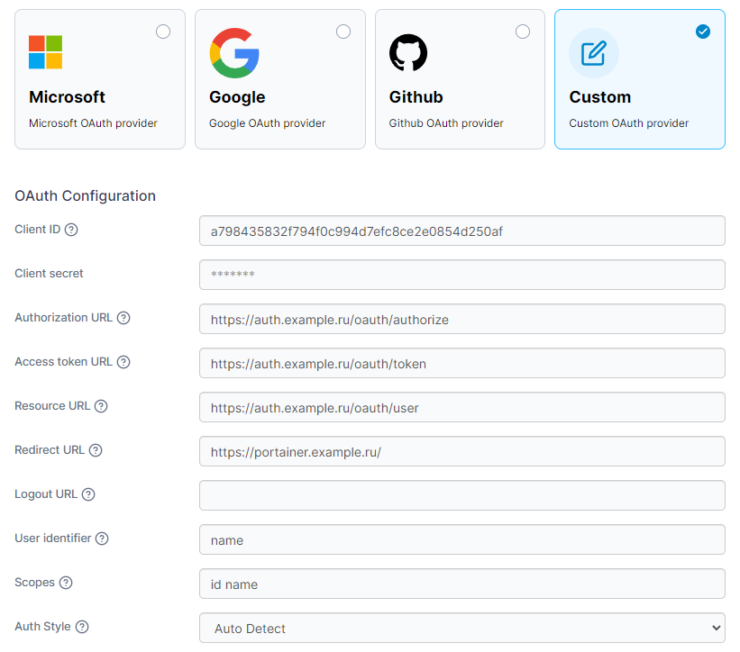

# Kauth

The OAuth 2.0 server, written in Go, implements the **Authorization Code Grant** standard.

**The Authorization Code** grant type is used by confidential and public clients to exchange an authorization code for
an access token.
After the user returns to the client via the redirect URL, the application will get the authorization code from the URL
and use it to request an access token.

## Quick start

1. Create **docker-compose.yml**:

    ```yml
    services:
      api:
        image: dihasi/kauth:v1
        container_name: api
        env_file:
          - .env
        volumes:
          - ./configs:/app/configs
        depends_on:
            postgres:
              condition: service_healthy
            redis:
                condition: service_healthy
        networks:
          - proxy
    
      postgres:
        image: postgres
        container_name: postgres
        ports:
          - 54327:5432
        environment:
          POSTGRES_USER: postgres
          POSTGRES_PASSWORD: postgres
          POSTGRES_DB: postgres
        volumes:
          - postgres_data:/var/lib/postgresql/data
        networks:
          - proxy
        healthcheck:
          test: ["CMD-SHELL", "pg_isready -U postgres"]
          interval: 5s
          timeout: 5s
          retries: 5
    
      redis:
        image: redis:alpine
        container_name: redis
        networks:
          - proxy
        healthcheck:
          test: ["CMD", "redis-cli", "ping"]
          interval: 5s
          timeout: 5s
          retries: 5
    
    volumes:
      postgres_data:
    
    networks:
        proxy:
            external: true
    ```

2. Create folder **./configs** and add **configuration.yml** to it:

    ```yml
    oauth:
      clients:
        <Client Name>:
          client_id: "<hex string>" 
          homepageURL: "https://app.example.ru/"     # redirect url
          client_secret: "<bcrypted base64 string>"  # docker run --rm -it johnstarich/bcrypt -P
    
    # optional
    forwardauth:
      auth-url: "https://auth.example.ru/login"      # login endpoint
      domain: ".example.ru"                          # for cookies
    ```

3. Add **users.yml** to **./configs** for creating users database:

    ```yml
    users:
      <USERNAME>:
        password: '<PASSWORD' # docker run --rm -it johnstarich/bcrypt -P
      <USERNAME2>:
        password: '<PASSWORD>'
      ```

4. Create **.env**:

    ```env
   APP_PORT=8080

   LOG_LEVEL=info # not using yet
   
   DB_USERNAME=postgres
   DB_PASSWORD=postgres
   DB_HOST=postgres
   DB_PORT=5432
   DB_NAME=postgres
   DB_SSLMODE=disable
   
   REDIS_HOST=redis
   REDIS_PORT=6379
   
   SECRET_KEY=<A 32-character base64 string>
   ```

5. Run **docker compose**:

   ```bash
   docker compose up -d
   ```
---

## Examples

### Example of integration with Portainer



### Example of using Forward Authentication with Caddy
   ```
   app2.example.ru {
       forward_auth api:8080 {
           uri /forward-auth/auth
           copy_headers Remote-User Remote-Groups Remote-Name Remote-Email
       }
       reverse_proxy web_aplication:3001
   }
   ```

---

## Additional

- [OAuth 2.0 Specification](https://tools.ietf.org/html/rfc6749)
- [Caddy Forward Authentication Documentation](https://caddyserver.com/docs/caddyfile/directives/forward_auth)

---
